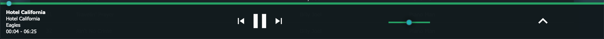
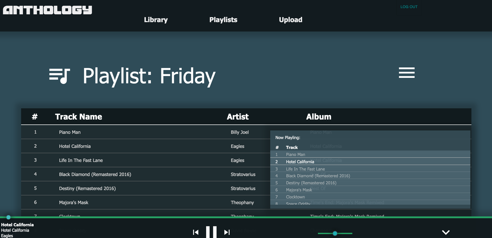
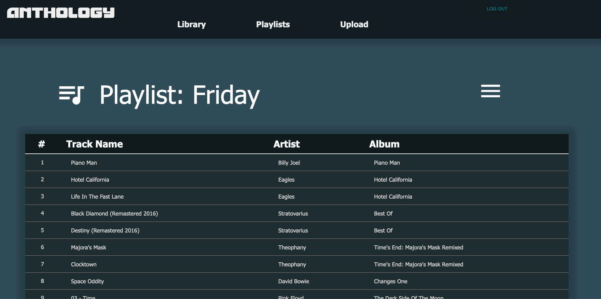
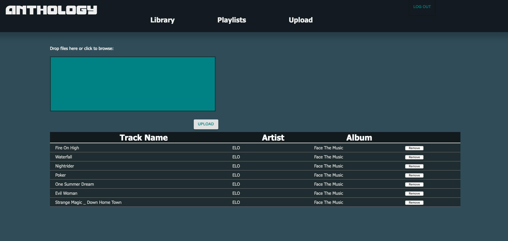

# Welcome to my Prime Solo Project ANTHOLOGY

## what is this?
  This project is the culmination 15 weeks of immersive learning at Prime Digital Academy.   
  This project was defined, scoped, and build by me using the tools provided by Prime.   

  Anthology is a self-host client/server music platform. You can install this app on a host machine  
  and use this app to organize, and manage your music collection. 

## Features:
  * full featured music player
    - volume controls
    - track position seeking
    - playlist // queue 
    - play/pause, previous song, next song
    - song info display   

  
  


  * Music Library List
    - interactive table to play music, add music to the queue, or delete the music from your collection
  
  * Playlist create / management
    - allows users to organize their music into playlist which can be played back in bulk
    - controls within the TrackList component allow users to add songs to their existing playlists

  


  * Track Upload
    - Allows users to upload new music to the database. 
    - includes feedback on the status of new track uploads (snackBar alerts from material UI)
    - displays list of track currently trying to be uploaded



## Use the Template for This Repository (Don't Clone) 

- Don't Fork or Clone. Instead, click the `Use this Template` button, and make a copy to your personal account.


## Prerequisites

Before you get started, make sure you have the following software installed on your computer:

- [Node.js](https://nodejs.org/en/)
- [PostrgeSQL](https://www.postgresql.org/)
- [Nodemon](https://nodemon.io/)

## Create database and table

Please reference the `database.sql` file for more information on how the database should be configured for this project

## Development Setup Instructions

- Run `npm install`
- Create a `.env` file at the root of the project and paste this line into the file:
  ```
  SERVER_SESSION_SECRET=superDuperSecret
  ```
  While you're in your new `.env` file, take the time to replace `superDuperSecret` with some long random string like `25POUbVtx6RKVNWszd9ERB9Bb6` to keep your application secure. Here's a site that can help you: [https://passwordsgenerator.net/](https://passwordsgenerator.net/). If you don't do this step, create a secret with less than eight characters, or leave it as `superDuperSecret`, you will get a warning.
- Start postgres if not running already by using `brew services start postgresql`
- Run `npm run server`
- Run `npm run client`
- Navigate to `localhost:3000`

## Production Build

Before pushing to Heroku, run `npm run build` in terminal. This will create a build folder that contains the code Heroku will be pointed at. You can test this build by typing `npm start`. Keep in mind that `npm start` will let you preview the production build but will **not** auto update.

- Start postgres if not running already by using `brew services start postgresql`
- Run `npm start`
- Navigate to `localhost:5000`

Directory Structure:

- `src/` contains the React application
- `public/` contains static assets for the client-side
- `public/FS_songs` contains the database of songs for this build when a user uploads them
- `build/` after you build the project, contains the transpiled code from `src/` and `public/` that will be viewed on the production site
- `server/` contains the Express App